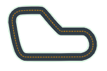
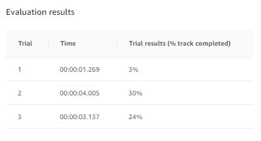
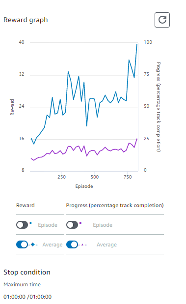
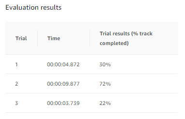
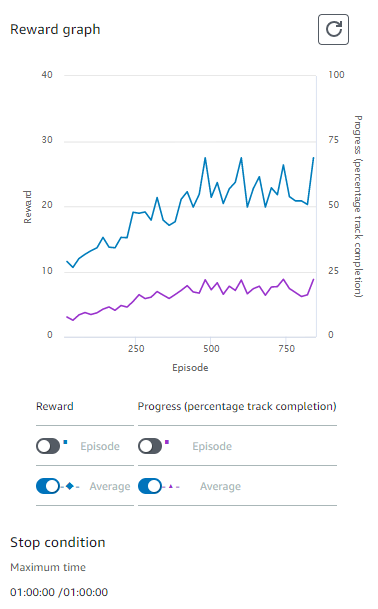
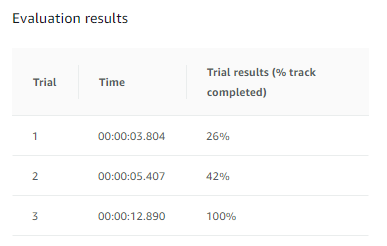

# 実験
以下の共有設定の元で実験を行った。
## course
* re:Invent 2018

<p align="center">

</p>

## 状態数
* Maximum steering angle : -30 ～ 30 degrees
* Steering angle granularity: 7
* Maximum speed: 12
* Speed granularity: 3

## Hyperparameter
| パラメータ名 | 設定 |
----|---- 
| 学習時間 | 60 [min] |
| Gradient descent batch size | 64 |
| Entropy | 0.01 |
| Discount factor | 0.999|
| Loss type | Huber|
| Learning rate| 0.0003|
| Number of experience episodes between each policy-updating iteration| 20|
| Number of epochs|10|

## 報酬関数実験
様々な報酬関数の設計に従ってどのようになるか実験する。
### 実験1
まっすぐ走るとお得な場合 (`reward_function_1.py`)を利用する。
* training
<p align="center">

</p>

* evaluate
<p align="center">

</p>

### 実験2
速いスピードがよい(`reward_function_2.py`)を利用する。
* training
<p align="center">

</p>

* evaluate
<p align="center">

</p>

### 実験3
ジグザグ走行抑止(`reward_function_3.py`)を利用する。
* training
<p align="center">

</p>

* evaluate
<p align="center">

</p>


(4) ース上に設定されたポイントに向かって進むように制御する
```
reward_function_4.py
```
(5) ステップとプロセスに関する報酬関数
```
reward_function_5.py
```
