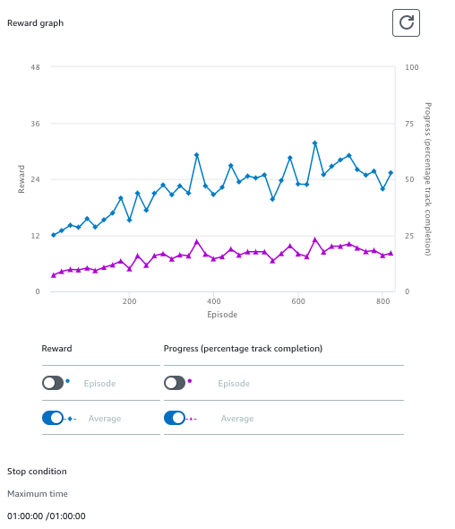
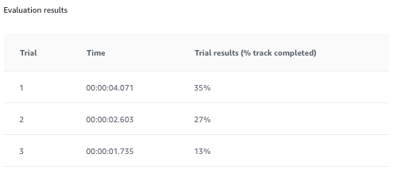

# 実験
以下の共有設定の元で実験を行った。
## course
* re:Invent 2018

## 状態数
* Maximum steering angle : -30 ～ 30 degrees
* Steering angle granularity: 7
* Maximum speed: 12 or 3
* Speed granularity: 3

## Hyperparameter
| パラメータ名 | 設定 |
----|---- 
| 学習時間 | 60 [min] |
| Gradient descent batch size | 64 |
| Entropy | 0.01 |
| Discount factor | 0.999|
| Loss type | Huber|
| Learning rate| 0.0003|
| Number of experience episodes between each policy-updating iteration| 20|
| Number of epochs|10|

## 報酬関数実験
様々な報酬関数の設計に従ってどのようになるか実験する。最初に実験結果を以下にまとめ、各報酬関数に関しては後述する形式とする。実験結果の見方はまず、
* 学習時のグラフ  
**青線** が獲得報酬値であり、**紫色**は完走率となる。基本的には完走率が上昇しているか？どの程度かをまず見るのが良いと思う。また報酬値が計算を繰り返している中で現祖父していないかを確認する。

* 評価のグラフ  
今回は３回の走行を実施している　`traial_results`が`100[%]`になっていない場合は完走していないということになる。そのためにそのときのラップタイムは意味がないので注意する。

* 結果
いくつかの報酬関数や動作モード、学習時間を変更して確認してみたが以下の点がわかった。結果
  * 報酬関数の良し悪しは当然ある。
  * 学習時間は学習が進む場合もあるし、学習が進まない場合もある。
  * `最大speed`と`完走率`はかなり関係がある。
    * `最大speed`が大きい ⇒ `完走率`が低下する。
    * `最大speed`が小さい ⇒ `完走率`が向上する。

| 順位 | 実験番号 | 完走率[%] |　時間 [sec]| 最大speed設定 [m/sec]　|
---- | ---- | ---- | ---- |---- |
|1 | 実験3(ジグザグ抑止) | 100 | 12.89 | 12  |
|2 | 実験9(ステアリング意識) | 100 | 33.968 | 3 |
|3 | 実験9(ステアリング意識) | 100 | 34.643 | 3 |

* まとめ  
報酬関数にも左右されると思うが、上記より、`最大speed`を低下させると完走率が確かに向上するようだ。
結構やってみた完走では、`最大speed`と`完走率`のトレードオフのような気がする。

### 実験1
まっすぐ走るとお得な場合 (`reward_function_1.py`)を利用する。
* training

* evaluate

### 実験2
速いスピードがよい(`reward_function_2.py`)を利用する。
* training

* evaluate

### 実験3
ジグザグ走行抑止(`reward_function_3.py`)を利用する。
* training

* evaluate

### 実験4
コース上に設定されたポイントにむかって制御する(`reward_function_4.py`)を利用する。
* training

* evaluate

### 実験5
過去の評価を反映する(`reward_function_5.py`)を利用する。
* training

* evaluate

### 実験6
過去の評価を反映する(`reward_function_6.py`)を利用する。その２
* training

* evaluate

### 実験7
実験3+実験４の複合関数。(`reward_function_7.py`)

* training

* evaluate

### 実験8
車軸と直近のwaypointsの接戦との軸を考慮した上でステアリングに対して報酬を調整した。
今回だけ180[min]の学習を実施。(`reward_function_8.py`)

* training

* evaluate

### 実験9
車軸と直近のwaypointsの接戦との軸を考慮した上でステアリングに対して報酬を調整した。
最大speedを `3 [m/sce]` に変更して学習してみる。
今回だけ[min]の学習を実施。(`reward_function_8.py`)

* training

* evaluate

